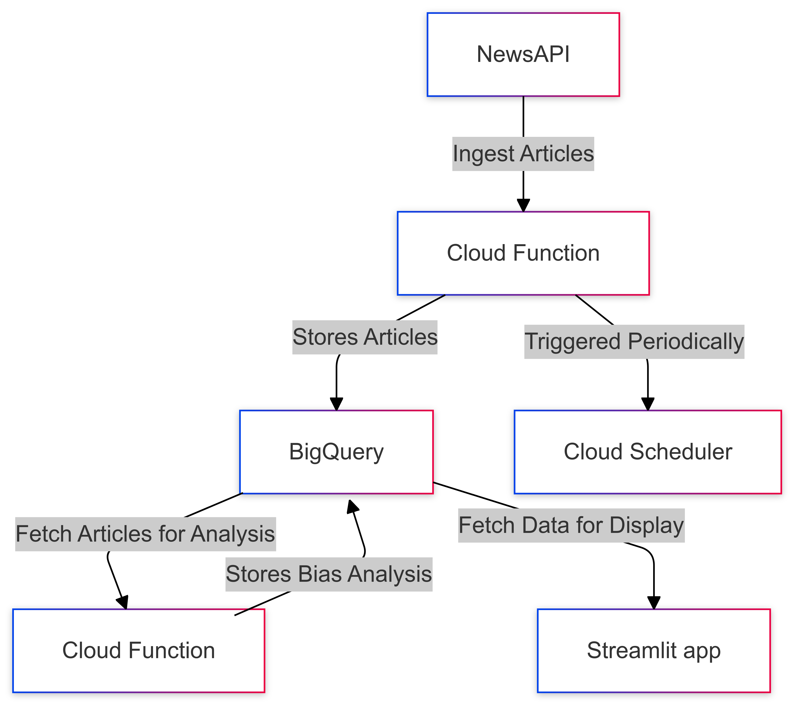

# AI News Bias Detection

## Overview

This project aims to detect bias in news articles related to Artificial Intelligence (AI) by analyzing the content and structure of the articles. It uses a data-driven approach to understand the narrative shift towards AI in news media, categorizing articles as either "AI Boomer" (optimistic) or "AI Doomer" (pessimistic).

## Project Structure

The project is structured as follows:

### Cloud Functions

1. **news-api-ingest**: Fetches news articles from NewsAPI and stores them in BigQuery.
   - Main file: `cloud_functions/news-api-ingest/main.py`
   - Deployment script: `cloud_functions/news-api-ingest/deploy.sh`

2. **news-classifier**: Classifies the fetched articles using zero-shot classification.
   - Main file: `cloud_functions/news-classifier/main.py`
   - Deployment script: `cloud_functions/news-classifier/deploy.sh`

### Streamlit App

The Streamlit app visualizes the analyzed data, showing trends and insights about AI-related news bias.
- Main app file: `streamlit/streamlit_app.py`
- Dockerfile: `streamlit/Dockerfile`
- Deployment script: `streamlit/deploy.sh`

### Data Flow

1. NewsAPI data is ingested using the `news-api-ingest` Cloud Function.
2. The ingested data is stored in BigQuery.
3. The `news-classifier` Cloud Function periodically processes the stored articles, classifying them as "AI Boomer" or "AI Doomer".
4. The Streamlit app fetches the classified data from BigQuery and visualizes it.

## Key Features

- Fetches and analyzes recent AI-related news articles
- Uses zero-shot classification to determine article bias
- Visualizes trends in AI narrative over time
- Compares bias across different news outlets
- Ranks journalists by their AI optimist/doomer predisposition

## Technologies Used

- Google Cloud Platform (BigQuery, Cloud Functions, Cloud Run)
- Python
- Streamlit
- Plotly
- Hugging Face Transformers (for zero-shot classification)
- Docker

## Setup and Deployment

Each component (Cloud Functions and Streamlit app) has its own deployment script. Refer to the respective `deploy.sh` files for deployment commands.